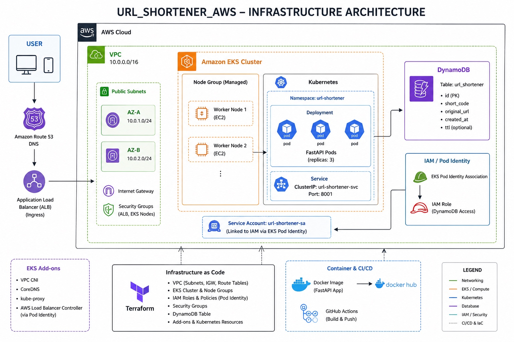

# 🚀 URL Shortener - AWS Cloud Native Microservices Platform

Architecture

## 1. Project Overview

URL Shortener is a production-style cloud native application built using FastAPI microservices and deployed on AWS using Kubernetes and Infrastructure as Code.

The system converts long URLs into compact short codes and redirects users with a low latency architecture optimized for high read traffic.

This project demonstrates:

- Microservice Architecture
- Containerization
- Cloud Native Deployment
- Infrastructure Automation
- Kubernetes Orchestration
- IAM Security
- CI/CD Automation

## System Highlights

| Feature | Implementation |
|-|-|
| Backend | FastAPI Microservices |
| Runtime | Python 3.11 |
| Container | Docker |
| Orchestration | Amazon EKS |
| Infrastructure | Terraform |
| Database | DynamoDB |
| CI/CD | GitHub Actions |
| Registry | Docker Hub |
| Cloud Provider | AWS |

# 2. High Level Architecture

Production Request Flow:

User

↓

Route 53 DNS

↓

Application Load Balancer

↓

Amazon EKS Cluster

↓

FastAPI Kubernetes Pods

↓

DynamoDB

Infrastructure:

AWS Region:

us-east-1

Network:

VPC:

10.0.0.0/16

Available IP Range:

2^(32-16)

= 65,536 IP Addresses

High Availability:

Availability Zones:

2

AZ-A:

10.0.1.0/24

256 IP Addresses

AZ-B:

10.0.2.0/24

256 IP Addresses

# 3. Application Architecture

The application follows microservice design.

Services:

## Shortener Service

Port:

8000

Responsibilities:

- Receive original URL
- Generate short code
- Store mapping

Endpoint:

POST /shorten

Example:

Input:

{
"url":
"https://example.com/my-long-url"
}

Output:

{
"short_url":
"https://domain.com/Ax91Bc"
}

## Redirect Service

Port:

8001

Responsibilities:

- Receive short code
- Search database/cache
- Redirect user

Endpoint:

GET /{short_code}

Response:

HTTP 307 Temporary Redirect

# 4. Short Code Generation

Implemented custom random code generator.

Character Pool:

A-Z

a-z

0-9

Total Characters:

62

Length:

6

Total possible combinations:

62^6

= 56,800,235,584

≈ 56.8 Billion URLs

# 5. Local Development Optimization

Initial Problems:

Python Version Issue:

Problem:

Python 3.13 package conflicts

Solution:

Migrated:

Python 3.13

↓

Python 3.11 Stable

Result:

Stable dependency environment.

# 6. Docker Implementation

Before Docker:

Application depended on:

- Local Python
- Virtual Environment
- Local machine setup

After Docker:

Portable deployment environment.

Created:

shortener_svc image

redirect_svc image

Base:

python:3.11-slim

Image Optimization:

Original:

~250 MB

Final:

~55 MB

Size Reduction:

(250-55)/250 ×100

≈ 78% Smaller Images

# 7. Multi Container Architecture

Implemented Docker Compose:

Containers:

1. Shortener Service

2. Redirect Service

3. Redis Cache

Architecture:

Client

↓

FastAPI Service

↓

Redis Cache

↓

DynamoDB

# 8. Redis Performance Optimization

Problem:

Every redirect request queried database.

Before:

Request

↓

DynamoDB

After:

Request

↓

Redis

↓

DynamoDB

Cache Hit:

O(1) lookup

Benefits:

- Reduced database load
- Faster redirects
- Lower latency
- Less DynamoDB cost

# 9. Database Migration

Initial Database:

SQLite

Problems:

- File based storage
- Container sharing issues
- Not horizontally scalable

Migrated To:

Amazon DynamoDB

Reason:

URL Shortener pattern:

short_code → original_url

DynamoDB Advantages:

- Single digit millisecond latency
- Serverless scaling
- No database management
- Automatic partitioning

Table:

url_shortener

Schema:

Primary Key:

short_code

Attributes:

original_url

created_at

TTL

Capacity:

PAY_PER_REQUEST

# 10. Terraform Infrastructure Automation

Complete AWS infrastructure provisioned using Terraform.

Created Resources:

Networking:

✔ VPC

✔ 2 Public Subnets

✔ Internet Gateway

✔ Route Tables

Compute:

✔ EKS Cluster

✔ Managed Node Groups

✔ EC2 Worker Nodes

Security:

✔ IAM Roles

✔ IAM Policies

✔ Pod Identity

Database:

✔ DynamoDB Table

Kubernetes:

✔ Deployments

✔ Services

✔ Add-ons

# 11. Amazon EKS Deployment

Cluster:

Amazon Elastic Kubernetes Service

Node Type:

Managed Node Groups

Application Deployment:

Namespace:

url-shortener

Pods:

3 Replicas

Benefits:

- High Availability
- Auto Recovery
- Rolling Updates

# 12. Kubernetes Architecture

Inside Cluster:

Deployment

↓

ReplicaSet

↓

3 FastAPI Pods

↓

Service

If one pod fails:

Kubernetes automatically recreates it.

Availability:

3 replicas running simultaneously.

# 13. Security Implementation

Avoided storing AWS keys inside containers.

Implemented:

EKS Pod Identity

Flow:

FastAPI Pod

↓

Service Account

↓

IAM Role

↓

DynamoDB

Benefits:

✔ Zero AWS credentials inside image

✔ Least privilege access

✔ Secure AWS authentication

# 14. CI/CD Pipeline

Implemented automated deployment using GitHub Actions.

Pipeline:

Developer Push

↓

GitHub Actions

↓

Docker Build

↓

Docker Hub Push

↓

Kubernetes Deployment

Automation Achieved:

✔ Automatic image build

✔ Automatic registry upload

✔ Repeatable deployments

# 15. Reliability Features

Implemented:

High Availability:

2 Availability Zones

Application Scaling:

3 Replicas

Database:

Serverless DynamoDB

Deployment:

Rolling Updates

Infrastructure:

100% Terraform Managed

# Final Results

Successfully built a production style AWS cloud native platform.

Achievements:

✔ 56.8 Billion possible URL mappings

✔ 78% Docker image size optimization

✔ Multi-AZ AWS architecture

✔ 3 Kubernetes replicas

✔ Serverless database migration

✔ Redis caching implementation

✔ Infrastructure fully automated

✔ Secure IAM authentication

✔ CI/CD automated workflow

# Skills Demonstrated

- AWS Cloud Architecture
- Docker
- Kubernetes
- Terraform
- EKS
- DynamoDB
- IAM Security
- Networking
- CI/CD
- Backend Microservices
